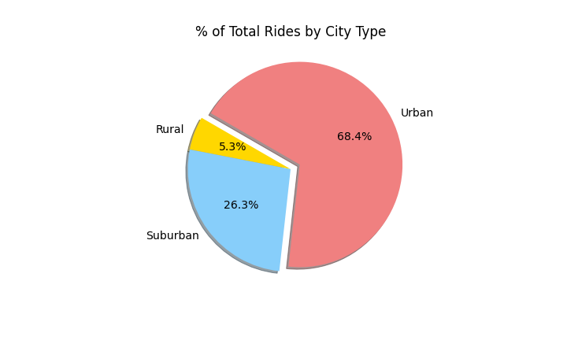
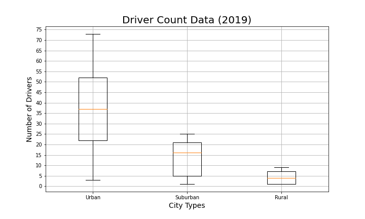

# Pyber_Analysis

# Overview
* The purpose of this analysis was to indentify business trends within different geographics of "rural", "suburban" and "urban" areas in terms of relationships between "drivers" and "fares."
* These patterns were demonstrated with different data visualizations to clearly present the results.
* The results were used to come up with 3 recommendations on how to improve Pyber.

# Results
* The analysis of the data shows that there is a correlation between geographic region and number of rides. This means that urbans areas with a higher density of population take part in more rides, while more rural areas with smaller populations have far less rides recorded. Suburban areas met in the middle of both rural and ubran regions.
* See table below for summary of the analysis:

* This data was used to compare the 3 different geopgrahical regions of city types by looking at "total number of rides by city type", "total dolalr amount of fares by city type", "total number of drivers by city type", " average dollar amount of fare per ride and driver" and "total dollar amount of fare by city type."

# Summary
* The analysis points to 3 main recommendations by city type:
    1. **Increase number of driver offerings in suburban cities**  - There are more rides than drivers in suburban areas. It will be difficult to keep up with demand with populations from core downtown areas moving to more affordable living areas (suburban), coupled with the adoption of working from home becoming more popular. With that being said, we need to increase the number of drivers we have to offer in the suburban areas to decrease wait times and expand ride offerings. 
    2. **Increase fares during peak ride request hours in urban cities**  - The core of the business is currently in urban downtown regions making up the majority of rides. In this area we have more drivers than rides being given, therefore during peak hours we can increase our fares to increase profitability and make better use of our supply of drivers versus demand of riders.
    3. **Increase number of driver offerings in rural cities** - Rural is the smallest city type but should not be overlooked because it is currently the most profitable at an average fare of $55.49 per driver. In addition, there are currently more rides than drivers which could potentially mean we are not able to fulfill the demand of rides requested with our current supply of drivers. As stated before, with working from home becoming more popular, we see a shift in populations moving to more rural areas, therefore we need to increase our driving offering in these areas to meet demand to maximize profits.
